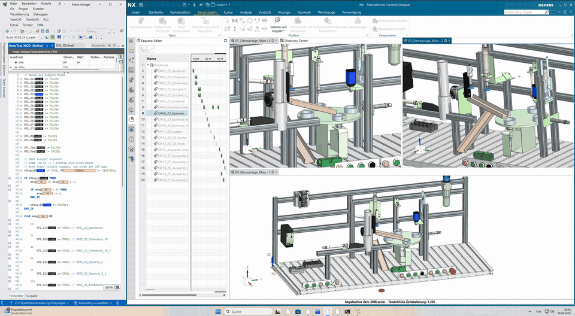
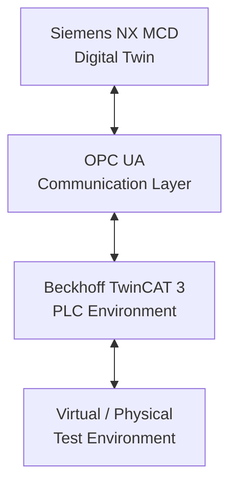

# Festo Digital Twin – NX MCD, TwinCAT 3 and OPC UA

**Project demonstration:** [Watch the full video on YouTube](https://youtu.be/7vSepeVt3s8)

The video shows the digital model, automation integration and virtual test behavior at project level.

This repository presents a portfolio case study of a digital-twin automation project integrating Siemens NX Mechatronics Concept Designer, Beckhoff TwinCAT 3, OPC UA and a Festo pneumatic demonstration system. Engineering source code, detailed machine models and technical documentation are intentionally not publicly distributed.

## Project Overview

The project focused on preparing a digital representation of the Festo system in Siemens NX MCD and connecting it to a TwinCAT 3 automation environment through OPC UA. The integration supported virtual signal and process testing before complete physical testing was available.

The virtual model and the available physical setup were used as complementary test environments. This made it possible to evaluate communication and system behavior while keeping the implementation, machine configuration and internal design information private.

## System Architecture

This conceptual view intentionally omits node names, addresses, signal definitions and machine configuration.

## My Contribution

- Prepared the digital representation and its mechatronic behavior in Siemens NX MCD.
- Prepared the PLC-side environment and established OPC UA communication.
- Integrated and verified signals between the model and automation environment.
- Implemented and evaluated a multi-step, open-loop virtual test sequence.
- Investigated communication, model-behavior and physical-system constraints.
- Compared virtual behavior with the available physical test setup.

## Development Workflow

1. Prepared the digital model and its required mechatronic behavior.
2. Defined the virtual interactions needed for system-level testing.
3. Prepared the PLC environment for integration.
4. Connected the model and automation environment through OPC UA.
5. Verified signal exchange and model responses.
6. Ran a multi-step virtual test sequence.
7. Compared the virtual behavior with the available physical setup.
8. Troubleshot integration issues and refined the test setup.

## Virtual Testing

Virtual testing used a time-based, open-loop, multi-step sequence to evaluate model behavior, signal exchange and communication integration. The sequence supported integration testing without disclosing the underlying control logic and should not be interpreted as full closed-loop control of the physical machine.

## Physical System Testing and Limitations

Mechanical and pneumatic constraints in the available Festo test system prevented a reliable complete machine cycle. The project therefore focused on digital-model integration, communication, virtual testing and interaction with the available physical environment; it does not claim full physical commissioning or complete real-machine validation.

## Technologies

- Siemens NX Mechatronics Concept Designer
- Beckhoff TwinCAT 3
- OPC UA
- PLC / SPS
- Digital Twin
- Virtual Testing
- Industrial Automation
- Festo pneumatic demonstration system

## Confidentiality

Engineering source code, detailed machine models, signal mappings and technical documentation are intentionally not included in this public portfolio repository.

## About

Mechanical Engineer and M.Eng. Industry 4.0 student focusing on PLC/SPS programming, industrial automation, digital twins and commissioning.

[LinkedIn](https://www.linkedin.com/in/ahmedhaltas/)
